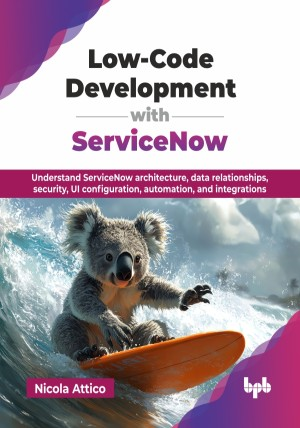

# Low-Code Development with ServiceNow

Understand ServiceNow architecture, data relationships, security, UI configuration, automation, and integrations.

This is the repository for [Low-Code Development with ServiceNow
](https://bpbonline.com/products/low-code-development-with-servicenow?variant=44504177246408),published by BPB Publications.

## About the Book
ServiceNow is a leading cloud-based platform that enables digital workflows to streamline business operations. This book offers valuable insights into the Now Platform and its technology stack, combining both classic and modern ServiceNow capabilities. Mastering these capabilities is essential for developing new low-code applications on the Now Platform and for configuring existing ones. 

Starting with fundamental concepts and PDI setup, this book progresses through data modeling, UI design with Core UI, Service Portal, and Now Experience, and server-side logic using business rules and APIs. Security is thoroughly covered with ACLs, data encryption, and KMF. You will explore automation through scheduled jobs, flows, and API integrations. Analyze Service Catalog, mobile app development using Now Mobile, and advanced AI and conversational features like Virtual Agent, NLU, and Now Assist. Learn to utilize the UI Builder, Playbooks, and Workspaces. Become skilled at automated testing with test suites, test cases, and client test runners. Finally, real-world use cases demonstrate ServiceNow’s versatility across industries, providing valuable best practices. 

By the end of this book, you will possess the skills to confidently develop sophisticated ServiceNow applications using low-code development. The book explains concepts from first principles with practical examples, while offering advanced insights from the author’s decade of experience with the Now Platform.

## What You Will Learn
• Understand ServiceNow low-code principles, architecture, tools, and instance setup for development and configuration.

• Master data model creation and server-side low-code development.

• Create powerful workflows and automation with ServiceNow and integrate with external systems.

• Build impactful user experiences and interactions across web, mobile, and conversational interfaces.

• Become proficient in client-side and server-side development, including scripting, APIs, and process flows.

• Implement security in ServiceNow using ACLs, encryption, and KMF.

• Master modern UI development with Now Experience, including UI Builder, custom components, and workspaces.
